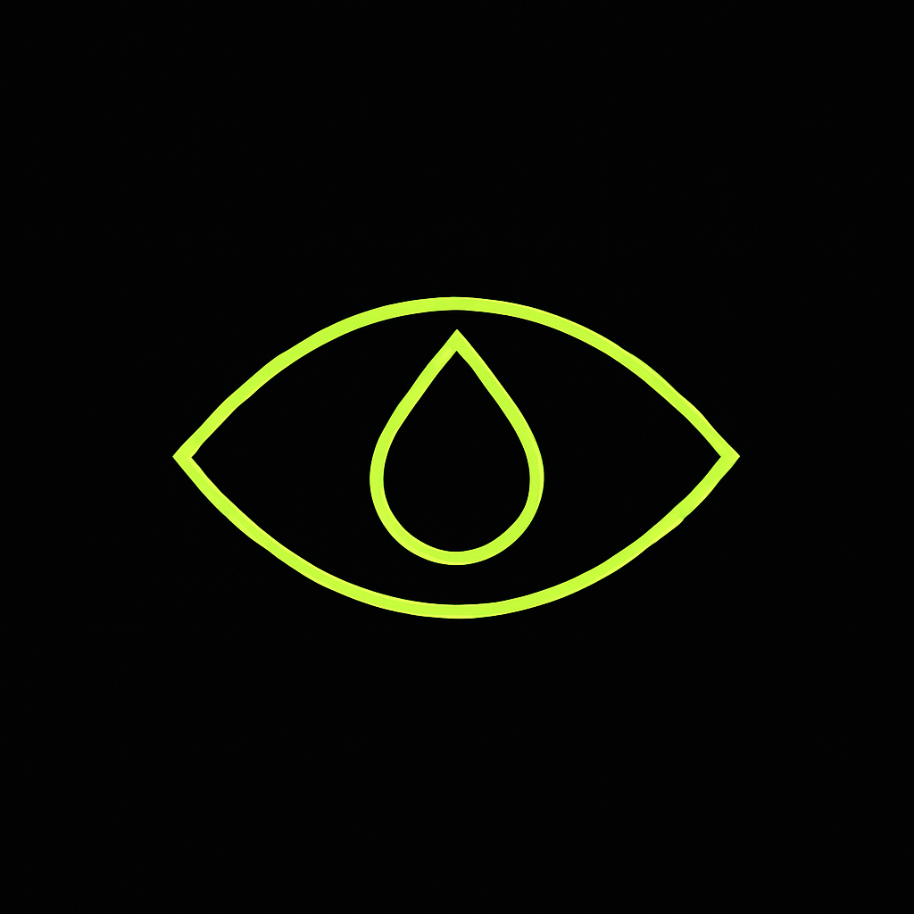

# ACiD Branding Guide

The visual identity of ACiD. Read this before creating anything.

---

## Why Visuals Matter Here

ACiD is founded by someone with nearly 30 years in art creation, curation, and production:

- Full production cinematography
- Songwriting, arrangement, recording, mixing, mastering
- Visual art and design

**This isn't decoration. It's core to the project.**

The belief: Code is just 1s and 0s without visual soul. When the founder first learned to code, it felt cold and sterile — until customizing the visual environment made building joyful again.

**ACiD's thesis:** Web3 builders lack visual inspiration. If they were more visually inspired, they'd build happier. Happy builders build better products for everyone.

Every visual decision in ACiD should:
1. Inspire creativity
2. Feel intentional, not default
3. Make developers want to build
4. Stand apart from corporate web3

---

## The Name

### Spelling

**Primary:** `ACiD`

Note the lowercase `i` — it's intentional.

### The Handle: @pHbalanceweb3

The thesis in the handle. "pH balance web3" — says exactly what we're about.

- Capital H in pH looks intentional and correct
- New people immediately understand the concept
- Bio can stay minimal since the handle explains itself

---

## The Logo

**File:** `assets/ACiD_logo_1.png`

One-shotted. AI-generated. Reverse image search clean.



### What It Is

An eye with a droplet as the pupil. Acid green linework on black. That's it.

### Why It Works

| Element | Surface Read | IYKYK Read |
|---------|--------------|------------|
| Eye | Awareness, vision | Third eye, awakening |
| Droplet pupil | Tear, water, liquid | A tab. A drop. You know. |
| Acid green | Tech company color | Acid. Obviously. |
| Linework only | Minimal, premium | Clean, not trying too hard |

**The wink, not the shout.**

### Versions Needed

- [x] Primary (acid green on black)
- [ ] White on black
- [ ] Black on white
- [ ] Favicon/icon size

### Usage

- PFP on all socials
- GitHub org avatar
- Documentation headers
- Future: merch, site, app icon

```
A C i D
│ │ │ │
│ │ │ └── D is uppercase (bold ending)
│ │ └──── i is lowercase (the seeing eye)
│ └────── C is uppercase
└──────── A is uppercase
```

### The Seeing Eye / Droplet

The lowercase `i` represents:

- **Awareness** — Not a dullard crypto user
- **The third eye** — Psychedelic reference (IYKYK)
- **Intelligence** — The AI in ACiD
- **Individuality** — Standing out in a sea of caps
- **A droplet** — A single drop. You know what kind. IYKYK.

When using the dot on the `i`, it can be stylized as:

```
👁  — The seeing eye (awareness, AI)
💧 — The droplet (a single dose, acid drop)
●  — Simple dot (minimal contexts)
```

The droplet works especially well for:
- Loading animations (drop falling)
- Logo variations
- Subtle merch designs
- "One drop changes everything" energy

```
Acceptable:
- ACiD (standard)
- AC👁D (stylized, social only)
- ACID (when systems don't support mixed case)

Not acceptable:
- Acid (looks like normal word)
- acid (too lowercase)
- AciD (wrong letter lowercase)
```

### The Backronym

> **A**rtificial **C**rypto **i**ntelligence **D**evelopment

Use when you need a "serious" explanation.

---

## Logo Concepts

We don't have final logos yet. Here are directions to explore:

### Direction 1: Chemical

```
     ●
    /|\      pH < 7
   / | \
  /  |  \
 ●───●───●
```

Molecular structure aesthetic. Clean. Scientific.

### Direction 2: Typography

```
ACiD
  👁
```

The name IS the logo. Focus on the `i` as the visual hook.

### Direction 3: Psychedelic Minimal

Flowing lines. Gradients. But restrained — not 1960s poster.

Think: What if Apple designed for psychonauts?

### Direction 4: Glitch/Digital

Corrupted text. Scan lines. The `i` glitching between states.

```
AC█D
AC▓D
ACiD
```

---

## Color Palette

### Primary

| Color | Hex | Usage |
|-------|-----|-------|
| Acid Green | `#39FF14` | Primary accent, highlights |
| Deep Black | `#0A0A0A` | Backgrounds |
| Pure White | `#FFFFFF` | Text on dark |

### Secondary

| Color | Hex | Usage |
|-------|-----|-------|
| Electric Purple | `#BF00FF` | Secondary accent |
| Neon Pink | `#FF00FF` | Tertiary accent |
| Cyan | `#00FFFF` | Links, interactive |

### Gradients

```css
/* Primary gradient */
background: linear-gradient(135deg, #39FF14 0%, #00FFFF 100%);

/* Psychedelic gradient (use sparingly) */
background: linear-gradient(135deg, #FF00FF 0%, #39FF14 50%, #00FFFF 100%);
```

### Dark Mode (Default)

ACiD is dark mode first. Light mode is secondary.

---

## Typography

### Display Font

Something bold. Slightly futuristic. Not too techy.

Suggestions:
- Space Grotesk
- Satoshi
- General Sans
- Or custom lettering for "ACiD"

### Body Font

Clean. Readable. Monospace for code.

Suggestions:
- Inter (body)
- JetBrains Mono (code)

### Hierarchy

```
H1: ACiD Display — Bold, Large
H2: Section Headers — Medium weight
Body: Clean sans-serif
Code: Monospace, slightly smaller
```

---

## Voice & Tone

### We Are

- Confident but not arrogant
- Funny but not try-hard
- Technical but accessible
- Counter-culture but welcoming
- Meme-fluent but not cringe

### We Are Not

- Corporate
- Aggressive
- Maximalist hype
- Taking ourselves too seriously
- Attacking competitors

### Example Copy

**Good:**
```
"Don't trip, we have no roadmap."
"web3 needs pH balance."
"You don't drop Base. Just sayin."
```

**Bad:**
```
"The revolutionary next-gen L2 solution!!!"
"Base KILLER incoming 🚀🚀🚀"
"10000x potential gem 💎"
```

---

## Social Media

### Twitter/X

- Handle: `@AcidL2` or similar
- Bio: Short, punchy. One of the taglines.
- Style: Memes, short takes, occasional technical threads

### Content Pillars

1. **pH Jokes** — The core meme
2. **Psychedelic References** — IYKYK energy
3. **AI/Tech** — Agentic finance takes
4. **Build Updates** — What's shipping (minimal hype)

### Image Style

- Dark backgrounds
- Neon accents
- Clean typography
- Subtle psychedelic elements (not overwhelming)
- The seeing eye motif

---

## Don'ts

1. **Don't use rainbow vomit** — Psychedelic ≠ chaotic colors everywhere
2. **Don't attack Base** — We root for them
3. **Don't use rocket emojis** — We're not that project
4. **Don't overpromise** — Underpromise, occasionally deliver
5. **Don't be corporate** — If it sounds like a press release, rewrite it

---

## Assets Needed

### Phase 1 (MVP)

- [ ] Wordmark logo (ACiD with styled i)
- [ ] Icon (for favicons, social)
- [ ] Twitter banner
- [ ] OG image template
- [ ] Basic color/font definitions

### Phase 2 (Post-Launch)

- [ ] Full brand guide
- [ ] Animation guidelines
- [ ] Merch templates
- [ ] Community asset kit

---

## Inspiration

Visual references (not to copy, to vibe with):

- **Apple** — Minimal, premium, restrained
- **Teenage Engineering** — Playful but sophisticated
- **A24** — Artistic, distinctive, memorable
- **Early Skate Culture** — DIY, authentic, attitude
- **Blade Runner** — Neon noir, high tech low life

---

## Contributing Design

If you're a designer who gets it:

1. Read this guide
2. Open an issue with `design` label
3. Share concepts
4. Iterate with feedback

We're not prescriptive. If you have a vision that fits the vibe, show us.

---

<p align="center">
  <i>The brand should feel like discovering something, not being sold something.</i>
</p>
